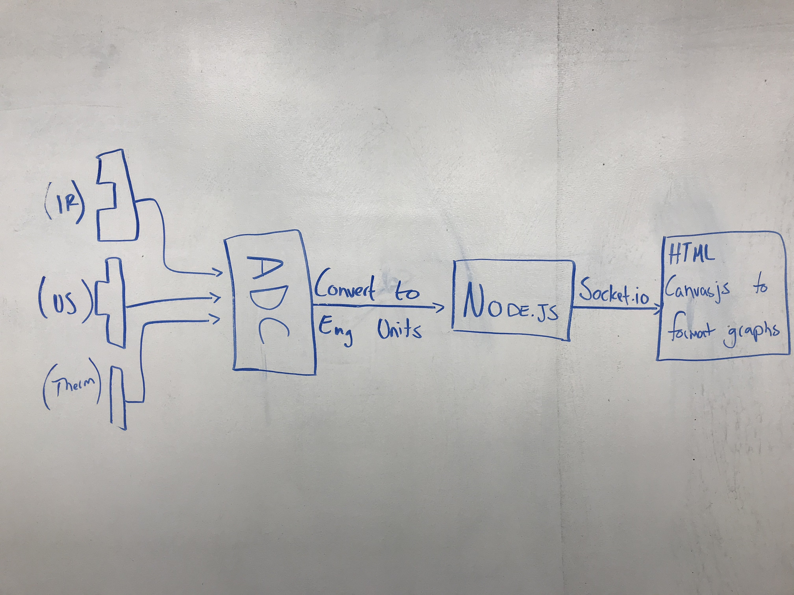
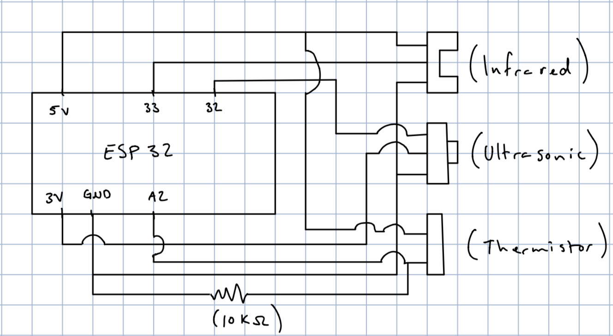
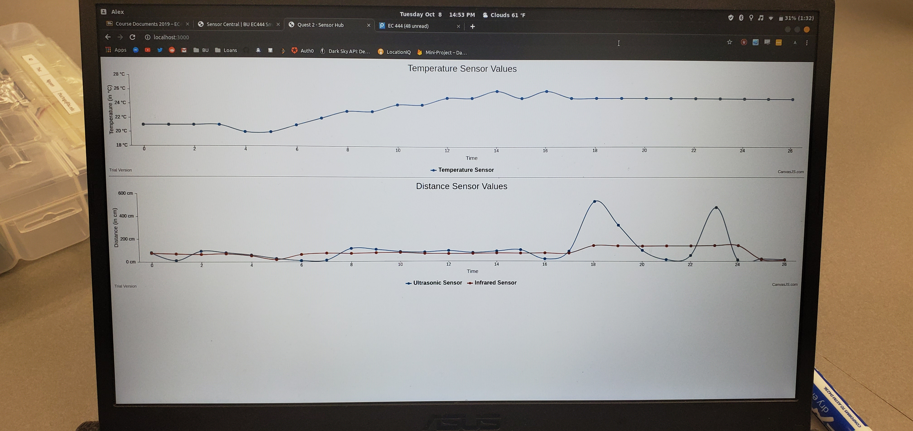

# Quest 2: Sensor Central
Authors: Karle Erf, Thuc Nguyen, Alex Salmi

2019-10-08

## Summary
In this quest, we assembled a circuit using all of the sensors from the individual skills(thermistor, ultrasonic, and IR)
along with the ESP32 in order to see the data from all 3 of these output at the same time. The data from the sensors was sent to
a server and output to graphs on a webpage using NodeJS and CanvasJS.

## Evaluation Criteria
Investigative question - The ESP32 ADC can read up to 200 ksps, which is 200,000 samples per second. Though that is the fastest that the ADC can read samples, the sensors do not take readings at that same rate. The thermistor takes readings at the same rate that the ADC does, this is due to the fact that it is not taking readings but is a resistor we are reading voltage off of. The ultra sonic range sensor reads in 100 ms cycles, and the infrared range sensor takes readings every 38.3 ms (+/- 9.6 ms). The resolution of each of our sensors is set to 12-bits in width.

## Solution Design
Circuit Design- We took the existing implementation of the ADC from the individual skills and added extra functionality. To do this we had to find extra pins to use for ADC1 reading. Once we found two other pins to use for the sensors we wired them up in the same way as each individual skill. Each ADC and sensor were then initialized so that we could recieve the data from each one independently. Finally we had to implement the conversions needed to get the raw readings into engineering units.

NodeJS- The data produced by the sensors and sent to the ADC on the ESP32 is then passed from the serial port of the
ESP32 to our NodeJS file which creates an server at localhost:3000 and passes the data to an html file.

CanvasJS- We send the data from the node server to the html file using a socket connection. In the html file, we read the data, parse it, and consolidate it in arrays to then pass to the canvasjs components to display the data neatly in graphs. We had two separate graphs: one with a temperature y-axis to display the thermistor data, and one with a distance y-axis to display the IR and ultasonic sensor data with two separate lines.

## Sketches and Photos
Approach and Flow Chart

  
Circuit Diagram Used

Graph Output

## Supporting Artifacts
- [Link to repo](https://github.com/BU-EC444/Team17-Erf-Nguyen-Salmi)
- [Link to video demo](https://drive.google.com/file/d/18x4DV2xJD-x5f1orAxX985eSLGLSL1Gy/view?usp=sharing)
- [Link to explanation](https://drive.google.com/file/d/1OnfpVxIqX3HDdBnxJUrJpmcUjLf9lNsQ/view?usp=sharing)

## References

-----

## Reminders

- Video recording in landscape not to exceed 90s
- Each team member appears in video
- Make sure video permission is set accessible to the instructors
- Repo is private
