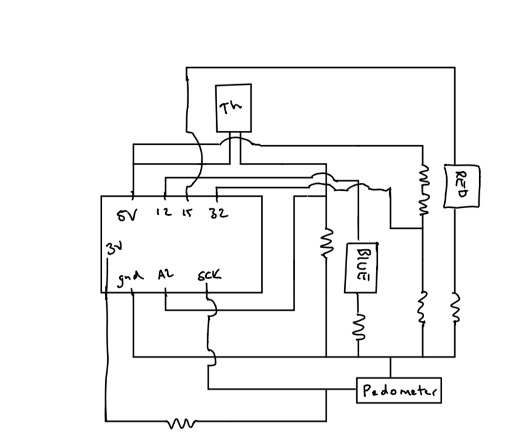
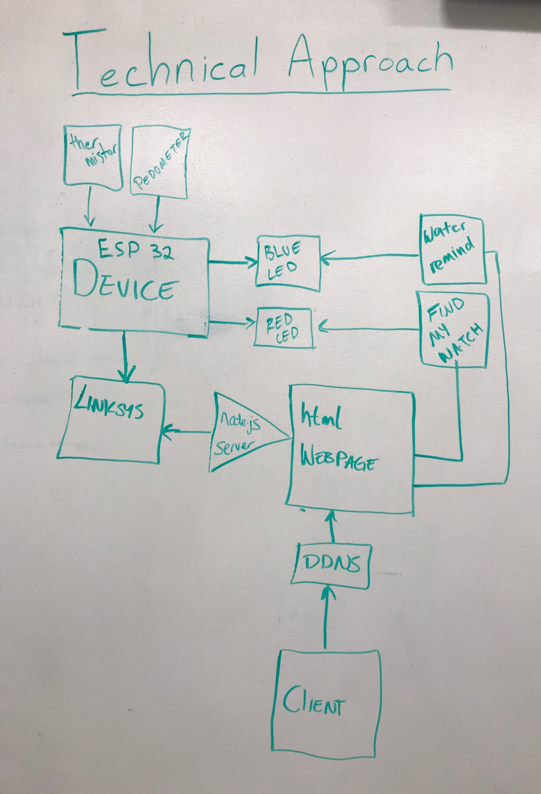

# Wearable
Authors: Karle Erf, Thuc Nguyen, Alex Salmi

2019-10-24

## Summary
In  this quest we used all the skills we have learned so far in order  to put together a smart wearable device. This device takes in environmental information around and on the user. This information is then able to be displayed to the user via a web application that  can be accessed from anywhere. The user can also control what the wearable device records from the web application. The final feature of the device is a "Find my Watch" function which will allow the user to locate there device  if it is lost by blinking the red  LED on the device.

## Evaluation Criteria
Investigative Question- To save on power we could use pwm for the LEDs so that they don't take up as much power from 
being at the maximum brightness level. In addition, we can have the html webpage update less frequently and in the time
that the webpage isn't updating we can have the sensors sleep or turn them off entirely. 

## Solution Design
Circuit Design- The device itself has three inputs and two outputs. The inputs consist of a vibration sensor  to act  as a pedometer, a voltage divider to act as a battery monitor,  and a thermistor to show body temperature. The outputs consist of two LEDs, one blue and the other red. The blue LED will blink periodically to remind the wearer to drink water. The red LED will blink when the user goes on the website to find their watch.

Router/DDNS- Because the initial DDNS service we decided to use only had a 7-day free trial, we had to reestablish a 
DDNS service for our router. We decided to use No-IP as our service rpovider and configured everything the same way that 
we previously. We also added all of our laptops to the port forwarding list instead of just one.

NodeJS/Webpage- We set up UDP packets to allow communication between the ESP and the NodeJS server. Once every second, this socket sends the values for the different sensors from the ESP to the server, and in response, the server sends information on which of the sensors should be enabled/disabled, if the red (find my watch) LED should turn on, and how often the blue (drink water) LED should flash. 
We also have an http webpage connected to the server. This webpage contains a graph displaying the temperature data over time, and text displaying the current number of steps, and the battery level of the ESP. We recieve this data from the server through a socket io (express) connection. We also have inputs on the webpage that allow the user to choose which sensors should currently be active or inactive, and an input for blinking the LED. This input data is sent back to the server using a post request, which then relays it back to the ESP through the UDP packets. 

## Sketches and Photos
Circuit Diagram

  
Technical Approach

  

## Supporting Artifacts
- [Link to repo](https://github.com/BU-EC444/Team17-Erf-Nguyen-Salmi)
- [Link to video demo](https://youtu.be/c7q0ZJSQin4)

## References

-----

## Reminders

- Video recording in landscape not to exceed 90s
- Each team member appears in video
- Make sure video permission is set accessible to the instructors
- Repo is private
