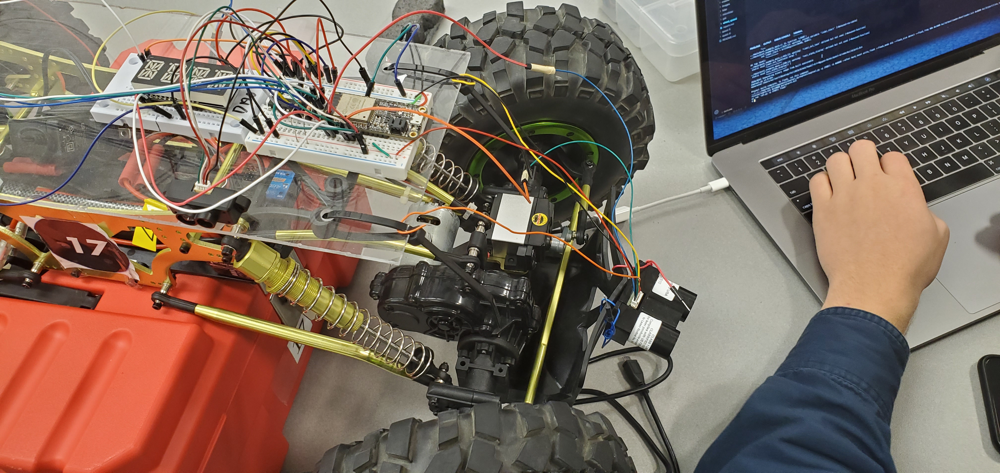
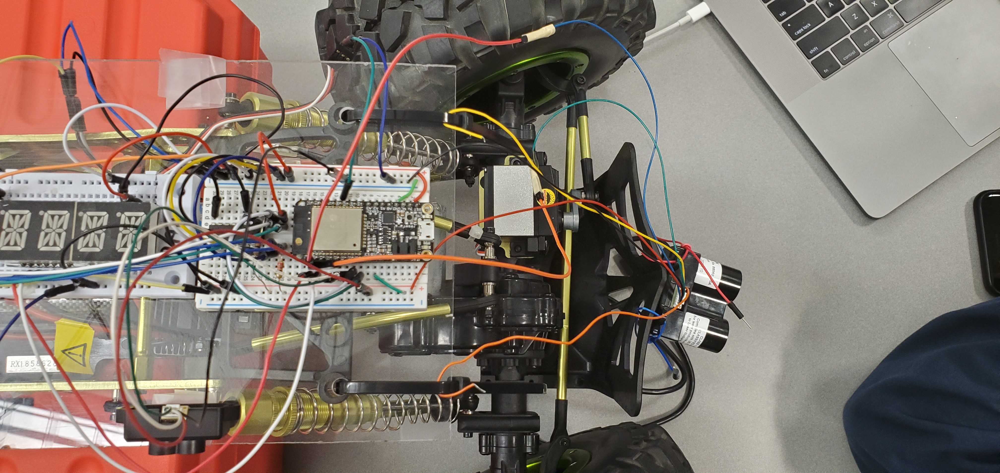

#  LIDAR

Author: Thuc Nguyen, 2019-11-08

## Summary
In this skill, we adapted the code from the accelerometer skill in order to read and write to the different registers on the LIDAR lite v3.
The LIDAR was connected to the ESP32 via I2C and then the code was modified so as to follow the initialization steps specified in the skill brief.

## Sketches and Photos

## Modules, Tools, Source Used in Solution
Github

whizzer.bu.edu

Garmin LIDAR Lite v3

Huzzah ESP32

## Supporting Artifacts

-----

## Reminders
- Repo is private
