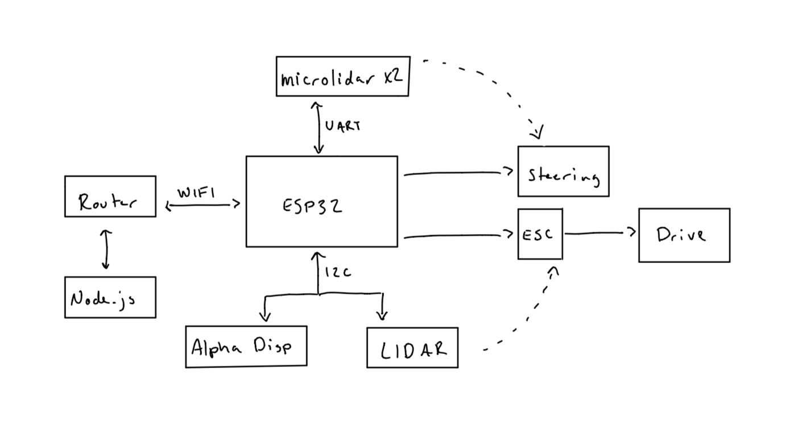

# Quest Name
Authors: Karle Erf, Thuc Nguyen, Alex Salmi

2019-11-11

## Summary
In this skill we utilized microlidar, lidar, an optical encoder, an alphanumeric display, and the crawler to create an autonomous vehicle. Using the onboard hardware on the crawler we could control the drive speed and steering through the ESP32. Next we attached the LIDAR to the front of the crawler to detect any obstacles and tell the ESP32 to stop the crawler. We also had two microlidar sensors connected to either side to measure distance from the walls and adjust the steering to stay in the middle of the track. The optical encoder  was  used on the rear wheel to determine the speed fo the vehicle, this output was then sent to the PID to dynamically control the speed of the crawler. The  alphanumeric display was used to display the speed of the vehicle. Finally the crawler could be started and stopped remotely from a node.js server.

## Evaluation Criteria
Investigative Question- A better sensor for the vehicle would need to be more accurate and consistent. Some of the issues
we encountered involved the LIDAR and microlidar reading in accurate values for distance and thus affecting the 
functionality of our vehicle. For both sensors, we'd likely want something with an accuracy of +/- 1 cm or less and for 
the microlidar we'd want it to have a minimum read distance of 0. 

## Solution Design
LIDAR- For this sensor, we connected it to the ESP32 via I2c using the SDA and SCL headers on the ESP32. The read and 
write register functions from the accelerometer skill were adapted to work with the LIDAR, specifically the read 
function for the LIDAR reads in 2 bytes rather than one, similar to the read16 of the accelerometer except it does it
all within the read function, including the bitwise OR of the 2 bytes. The read and write are used within a set of while
loops that perform the initialization procedure described in the LIDAR skill brief.

Microlidar- For the two microlidars, we connected them to the ESP32 via UART, using a separate UART channel for each sensor. We recieve the distance data from the microlidars every half second, and compare the distances from each of the two sensors to decide which direction the crawler should drive. At first, we set up both microlidars on one side, one in the front and one in the back, and tried to compare these distances to see if the crawler is driving towards or away from the wall, and adjust based on that. However, we were having issues keeping the crawler centered using this method. Therefore, we ended up putting one microlidar on the left side of the crawler, and the other on the right. This allowed us to simply tell which wall the crawler was closest to, and turn away from that wall. If the distances were approximately the same (+/- 5cm), the crawler drives straight. 

PID- The PID setup was fairly simple. We took our code from the PID skill, and instead of a target distance used in the skill, we set a target speed of 0.1 m/s, and adjusted he wheel speed based on that. Since we found values for the wheel speed functionality that corresponded to 0.1 m/s, and started the crawler at this speed, the PID did not end up changing the speed all that much, since it was at the target speed from the get go. 

Node Server- We decided to go with a simpler node server for this quest than previous ones, since all we needed to implement was a start/stop functionality. We decided to not include an HTML front end to the server, and to instead just read key inputs from the console. So, when the server is running, if the user inputs the letter 't' into the console, the server will send a UDP packet to the crawler telling it to toggle between the on/off states.

Wheel Speed- In order to control the speed of the wheels we used Pulse Width Modulation, as the ESC motor controller acts similar to a servo. This allowed us to set high and low values that corresponded to forward and reverse, as well as a neutral value in the middle to stop the crawler.

Steering- Steering was controlled by angle input to a servo much like the minute and hour hands of the retro alarm clock. Much like with the wheel speed the servo had a maximum, neutral, and minimum angles which were 90, 40, and 0 respectively.

## Sketches and Photos
Block Diagram of our crawler:

  

 

## Supporting Artifacts
- [Link to video demo](https://drive.google.com/file/d/1I-moHiz_1PwSZOIyUAko-bz28LiR0mNd/view?usp=sharing)

## References

-----

## Reminders

- Video recording in landscape not to exceed 90s
- Each team member appears in video
- Make sure video permission is set accessible to the instructors
- Repo is private
