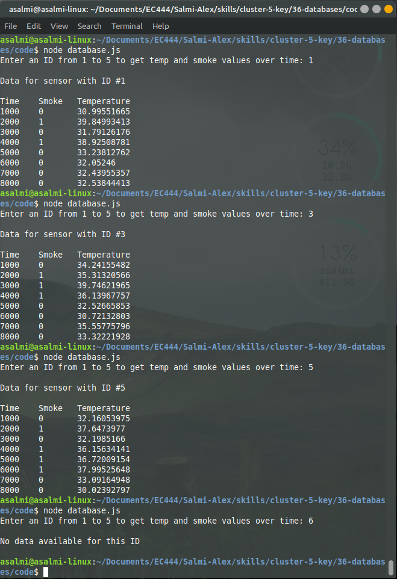

#  Skill 36: Databases

Author: Alex Salmi, 2019-11-14

## Summary
I have successfully managed to store the text data in a database, and then pull data out of this database with queries.

## Sketches and Photos
Example output of reading to database:

## Modules, Tools, Source Used in Solution
I used the example code found at tingodb.com as a template and worked from there.

## Supporting Artifacts

-----

## Reminders
- Repo is private
