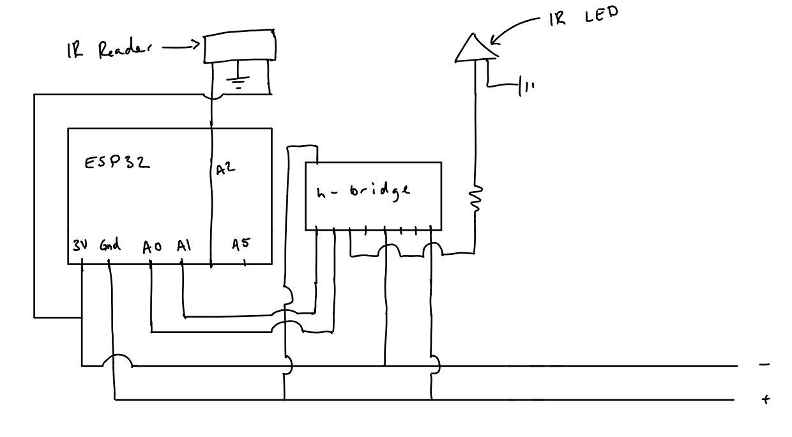
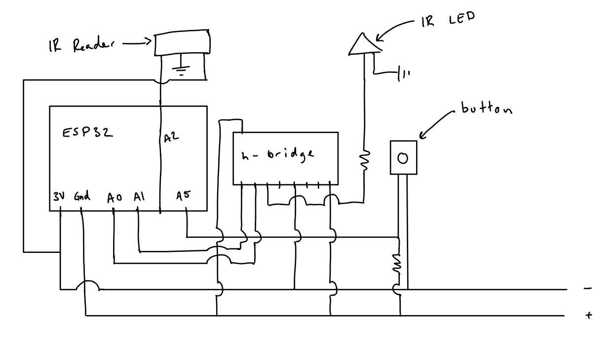
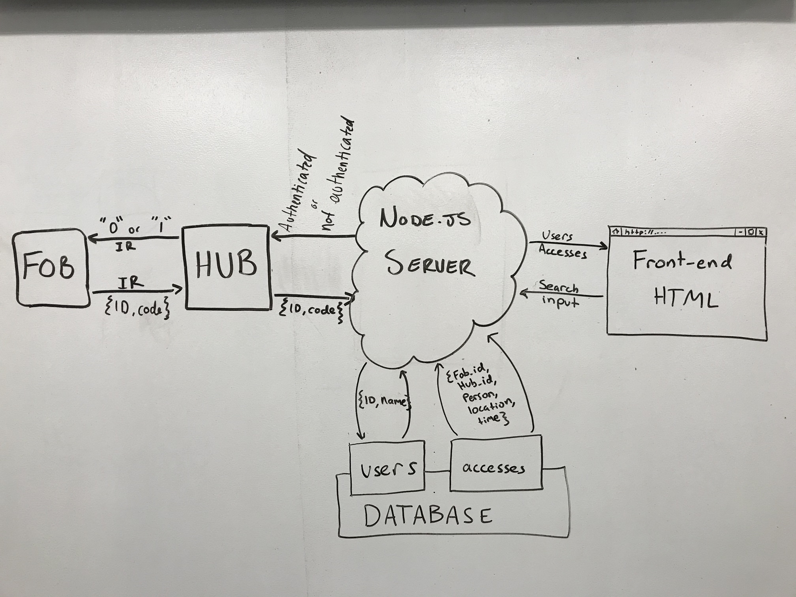

# Quest 5 :Security Key
Authors: Karle Erf, Thuc Nguyen, Alex Salmi

2019-11-22

## Summary
In this quest, we breadboarded IR transceivers for a fob-to-hub IR communication system. The system utilizes RMT receivers and IR LEDs for transmitting.
The fobs communicate to the hub via a button press which then triggers the hub to check the ID of the fob in our database using our node server.
After checking the ID of the fobs, the hub will communicate back to the fobs.

## Evaluation Criteria

Investigative Question: Because our system requires that the fobs be verified based on a unique ID, not all fobs or other devices that may try to gain access
to our server will be allowed to which means that any malicious users attempting to get access will be denied assuming they don't spoof a verified fob ID. 
Data is not encrypted between the server and the clients though so that is one security issue with our system. There is also no physical protection on the 
system so there is nothing protecting it against being physically damaged or stolen. A malicious user could listen in on the connections between the server 
and the fobs assuming they can spoof a verified ID. Since the data is not encrypted the user would be able to see what data is being passed between the server 
and the fobs. Such a user could also physically damage or steal parts of our system in order to render it inoperable. Protections against these attacks would 
include encrypting all data between the server and the fobs as well as keeping our system in a secure location and perhaps in a protective case of some sort.

## Solution Design
Fob - The fob was wired up with a IR transmitter and Reciever as well a physical button. The fob transmits its own personal ID when the button is pressed. It then recieves confirmation from the hub on it's own reciever and activates the onboard LED to signify that the fob has unlocked the hub and is "in the room".

Hub - The hub is very similar to the set up of the fob, but without the button. The hub is constantly reading waiting for a fob to come and unlock the door. When the hub receives an IR signal it sends the id to the server which then checks the database and the hub transmits either a '1' for authenticated or a '0' for not authenticated.

Database - We set up the database using tingoDB, which worked fairly well for us. We have two tables: 

 - Users, which containes all authorized fob_id's, as well as their user's names. 
 - Accesses, which contains all times that a fob locked or unlocked the hub. Stared as {fob_id, hub_id, person, time, location}

NodeJS - Our server recieves a code from the hub through a UDP socket, and then communicates with the tingoDB using tingoDB's commands to check if it is an authorized fob's code. If the code is in users table the database, the server will send a success response back to the hub through UDP, and the server will add an access entry into the database's access table. If the code is not in the database, the server will simply send a failed response back to the hub.
In addition to the hub, the server also communicates with the HTML front-end. On the html page, you can view all currently authorized users/fobs, and add a new one. The HTML page gets the users from the database via the server through socket.io, and similary submits newly inputted users to the database via the server through socket.io. The HTML page can also list all access records for a specific fob. THe user enters a fob_id into the HTMl page, this id is sent to the server, which queries the database, and the server sends the response data back to the HTML, where it is then displayed to the user.

State Model - Our state model consists of 4 states corresponding to Locked, Signal Sent, Verification, and Unlocked. We start in the Locked state
and transition to the Signal Sent state if the button on the fob has been pressed. If the signal has been received by the hub, we move into the
Verification state, if not, we return to the locked state. From the Verification state, we check to make sure the fob is a verified fob. If it is,
we move into the Unlocked state, if not, we move back to the lockec state. 

## Sketches and Photos
Hub  Circuit  Diagram

  
Fob Circuit Diagram

 

Block Diagram

 

## Supporting Artifacts
- [Link to video demo](https://drive.google.com/file/d/1oBurT1glvX62fq1IZzd0ilv2eb5FifJ3/view?usp=sharing)
- [Link to video presentation](https://drive.google.com/file/d/1pg3L_xDlFf-6m7zS92ecHuyFTWfaI5e4/view?usp=sharing)

## References

-----

## Reminders

- Video recording in landscape not to exceed 90s
- Each team member appears in video
- Make sure video permission is set accessible to the instructors
- Repo is private
