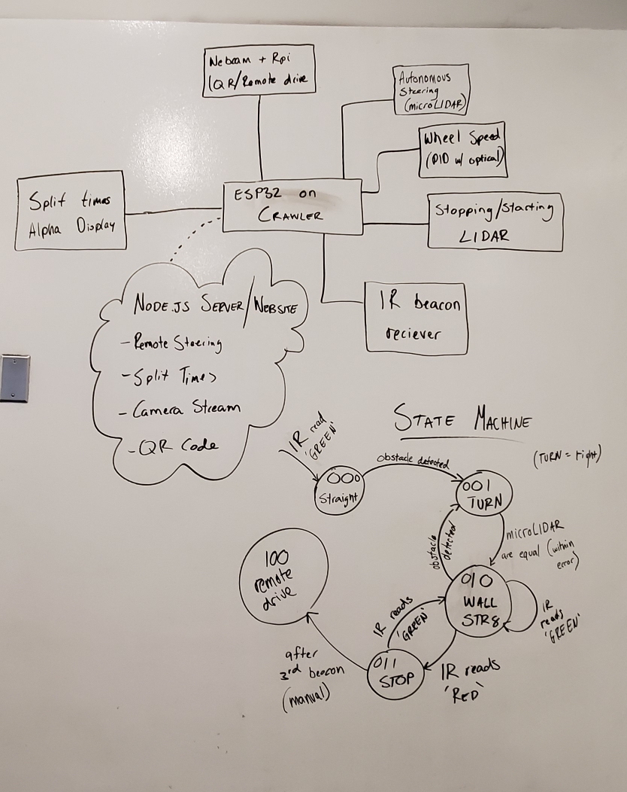

#  Raspberry Pi Camera

Author: Thuc Nguyen, Alex Salmi, Karle Erf, 2019-12-03

## Summary
Far this skill, we took the time to plan out our srategy for the Quest 6 rollup. As you can see in the image below, we started out by drawing a full block diagram of our system so that we could wrap our heads around what exactly needed to be included in this quest, and how it all connects with each other. This really helped us gain a better understanding of what the quest entailed, and how we would go about implementing the functionalities.
Next, we moved on to drawing the state diagram seen in the image below. As you can see, we have four states:

000: Drive straight
001: Corner Turn
010: Drive straight next to the wall
011: Stop
100: Remote driving

So, when the race starts, we wait for the beacon to be Green, then we simply drive straight in state 000, as there will be no wall for us to follow next to the crawler for the first section. Then, when we detect a wall in front of us with the collision sensor, we move to the 001 state to avoid the wall. After our side sensors detect we are parralell to a wall, we move on to the 010 state. If we are in state 010 and detect an obstacle with the collision sensor again, we move back to the 001 state to make the turn again. If we are in state 010 and detect a beacon, we either continue driving if the beacon is Green, or move to state 011 if the beacon is Red/Yellow. When we are in state 011, and the beacon turns green, we move back to state 010. If it turns green and we are on the last beacon, we move to state 100 to complete the course. 

This should be a good starting point for us to conceptualize how to implement this project, as we think we all have a better grasp of how we will design our crawler after having contemplated and drawn this state diagram.
 

## Sketches and Photos

## Modules, Tools, Source Used in Solution

## Supporting Artifacts
whizzer.bu.edu

-----

## Reminders
- Repo is private