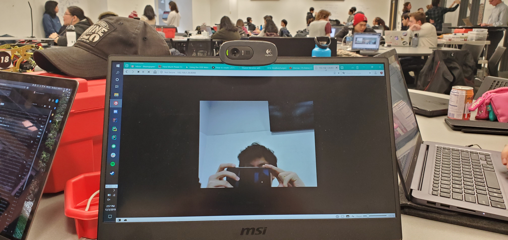
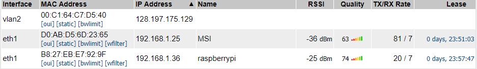
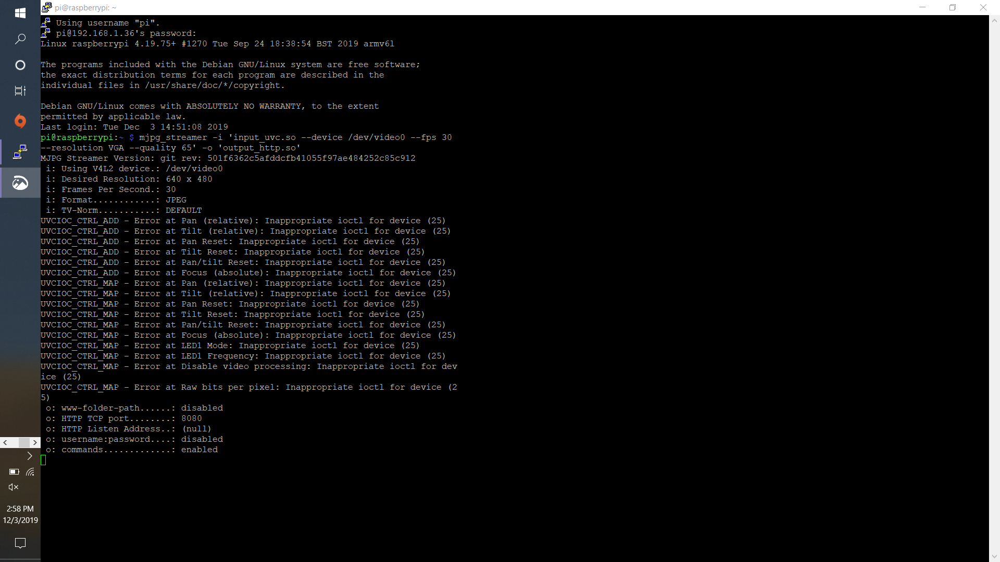

#  Raspberry Pi Camera

Author: Thuc Nguyen, Alex Salmi, Karle Erf, 2019-12-03

## Summary
For this skill we enabled ssh on the raspberry pi, installed the appropriate packages, and configured the pi as 
specified by the following blogpost https://wouterdeschuyter.be/blog/how-to-create-a-15-dollar-web-controllable-camera-with-a-raspberry-pi-zero
 

## Sketches and Photos

## Modules, Tools, Source Used in Solution

## Supporting Artifacts
whizzer.bu.edu

Github

Raspberry Pi Zero W

https://wouterdeschuyter.be/blog/how-to-create-a-15-dollar-web-controllable-camera-with-a-raspberry-pi-zero

Linksys Router

Logitech Webcam

-----

## Reminders
- Repo is private