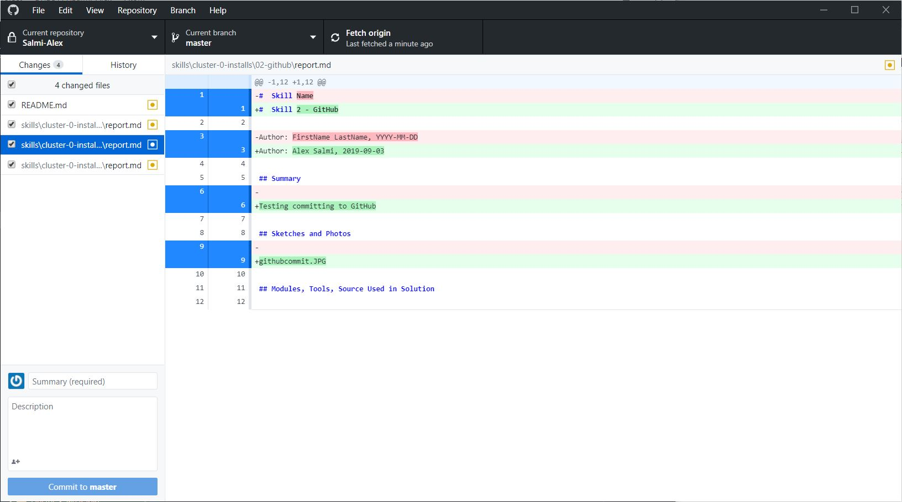

#  Skill 2 - GitHub

Author: Alex Salmi, 2019-09-03

## Summary
Testing committing to GitHub

## Sketches and Photos
Commit Example:

## Modules, Tools, Source Used in Solution

## Supporting Artifacts

-----

## Reminders
- Repo is private
