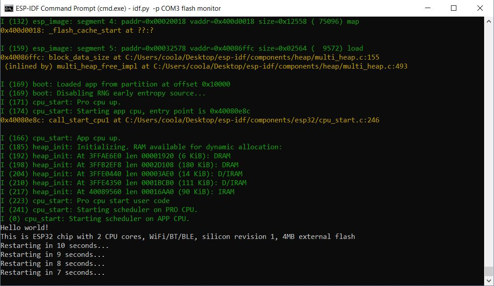

#  Skill 5 - Toolchain

Author: Alex Salmi, 2019-09-05

## Summary
Running the example programs worked correctly.
The helloworld example successfully printed Hello World! to the monitor, as seen in the screenshot below.
The blink example successfully makes the red LED on the ESP32 board blink, as seen in the video below.

## Sketches and Photos
Hello World Screenshot:

Video demonstration of Blink Example:

## Modules, Tools, Source Used in Solution

## Supporting Artifacts

-----

## Reminders
- Repo is private
