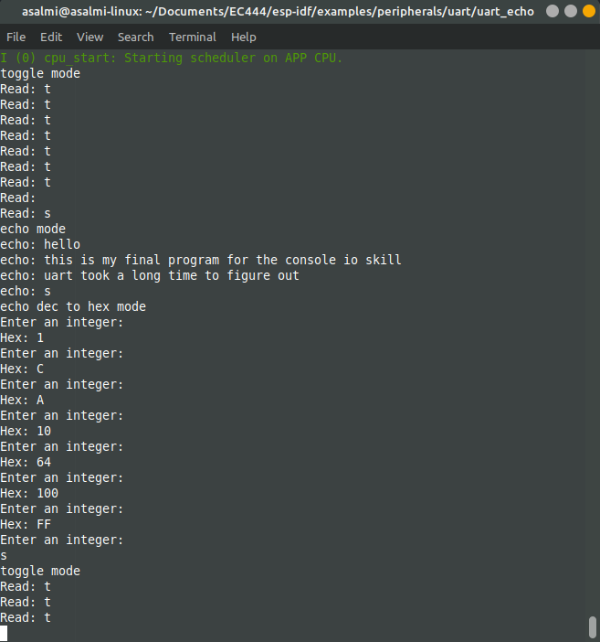

#  Skill 8 - Console

Author: Alex Salmi, 2019-09-13

## Summary
I successfully implemented a program that performs the toggle, echo, and echo dec to hex functions.
toggle: toggles the LED when the user enters 't'
echo: echos whatever string the user inputs
echo dec to hex: converts the user's inputted decimal number to hex
To switch between the functions, the user simply enters 's'

## Sketches and Photos
Output Image:

## Modules, Tools, Source Used in Solution
I used the uart_echo example from esp-idf as a template for this program

## Supporting Artifacts

-----

## Reminders
- Repo is private
