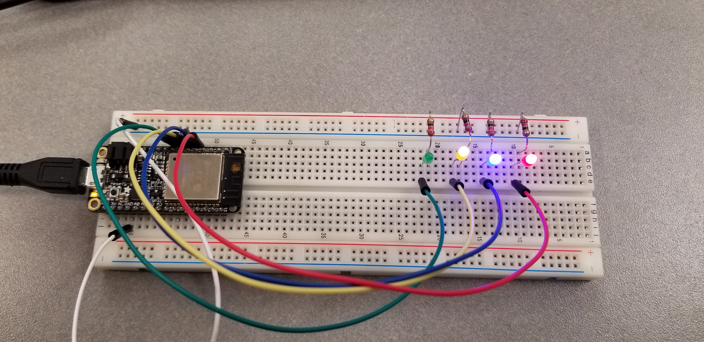
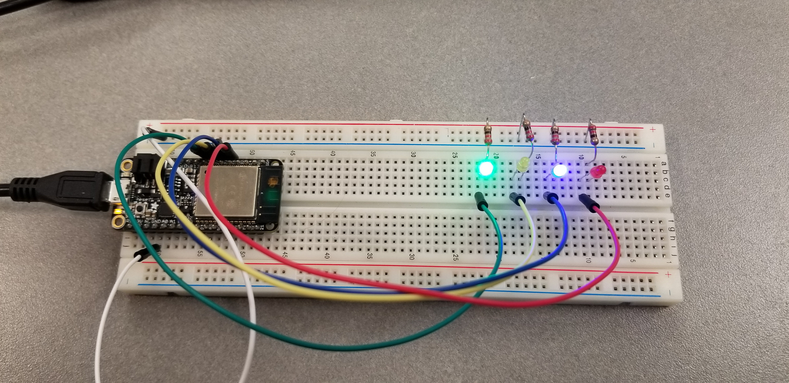

#  Skill 9 - GPIO

Author: Alex Salmi, 2019-09-10

## Summary
I successfully implemented a program that counts from 0 to 15 in binary using 4 LEDs on a breadboard, using the esp-idf.

## Sketches and Photos
Example Images:

Example Video:

## Modules, Tools, Source Used in Solution
I used the slides from class and code from whizzer as a template for this program

## Supporting Artifacts

-----

## Reminders
- Repo is private
