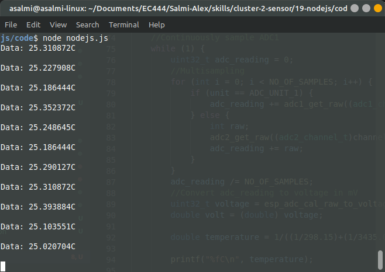

#  Skill 19 - Nodejs

Author: Alex Salmi, 2019-10-03

## Summary
I successfully managed to complete all of the assigned w3schools tutorials, and then get my temperature readings from skill 16 to show up on a console using a nodejs server.

## Sketches and Photos
Example Output:

## Modules, Tools, Source Used in Solution
Tutorials:
All of the code that is related to the w3schools tutorials (all of the files in the w3_tutorial_files folder), was created using the tutorials as reference. 

Final:
For the C code (temperature.c), I simply reused my code from skill 16 (thermistor.c) with a couple of tweaks. For the nodejs code (nodejs.js), I used a the code I wrote while completing the w3schools tutorials as reference.

## Supporting Artifacts

-----

## Reminders
- Repo is private
