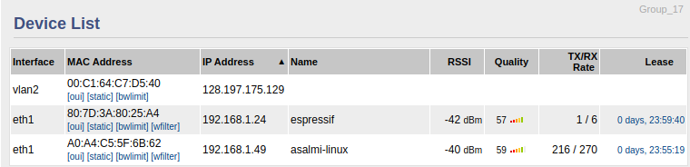
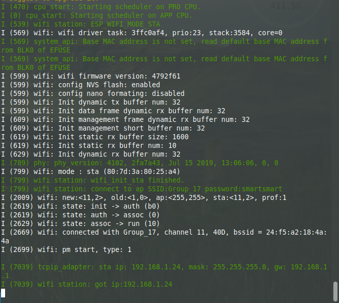

#  Skill 24 - Wifi

Author: Alex Salmi, 2019-10-11

## Summary
I successfully managed to get the esp connected to the router, and was able to see its IP address in the router's device list. This is shown in the images below.

## Sketches and Photos
Device List containing esp (espressif):

IP address of esp (matching IP address in device list above):

## Modules, Tools, Source Used in Solution
I used the wifi station example from the esp-idf repository as a template for this solution. I changed the SSID and password global variables to get the example working.

## Supporting Artifacts

-----

## Reminders
- Repo is private
