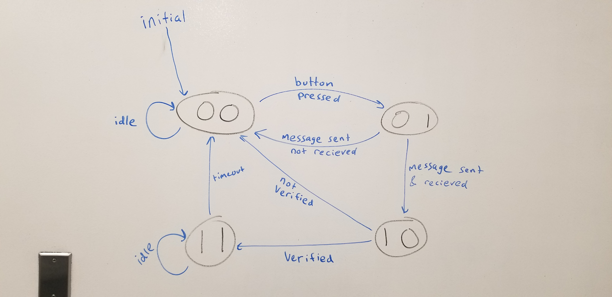
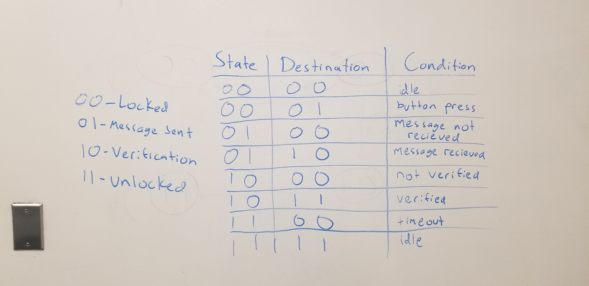

#  Skill 40: Skill Models

Author: Alex Salmi, 2019-11-22

## Summary
I was successfully able to model the given situation using a state model, as well as show the model in state table form. There are four states: locked, message recieved, verification, unlocked. Based on the transfer of the message, and verification acceptance, the state will change according to the model/table shown below.

## Sketches and Photos

## Modules, Tools, Source Used in Solution
briefs on whizzer

## Supporting Artifacts

-----

## Reminders
- Repo is private